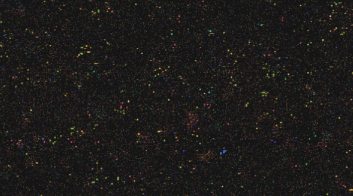

# artificial-life

A ~300-line Python reproduction of the BFF universe from the paper [**Computational Life: How Well-formed, Self-replicating Programs Emerge from Simple Interaction**](https://arxiv.org/abs/2406.19108).

## How it works

A 240×135 grid of randomly initialized [Brainfuck](https://en.wikipedia.org/wiki/Brainfuck)-like programs interact with their neighbors. Every epoch, each program is paired with a random neighbor — their instruction tapes are concatenated, executed for up to 2¹³ steps, and then split back apart.

The instruction set allows programs to read from and write to each other's tapes, creating selection pressure for self-replicating programs. As shown in the paper, **self-replicators spontaneously emerge** and quickly spread across the entire grid.

## Example

Every pixel represents one instruction; each opcode has a unique color, while near-black pixels are raw data. Every 8×8 block is one program.



Run a simulation yourself:

```bash
uv run main.py --seed 1
```

This produces `universe_mutation.gif` — a self-replicating pattern emerges early and spreads across the grid, until an even more efficient replicator evolves and takes over completely.

## Features

- **Numba JIT** — parallel execution of program pairs via `@njit(parallel=True)`
- **Background mutation** — configurable random bit-flip rate
- **GIF export** — colored visualization of the evolving grid
- **Metrics export** — opcode density and Shannon entropy over time
- **AI researcher** — `researcher.py` autonomously runs experiments and analyzes results using the Claude API

## Installation

Requires Python ≥ 3.14 and [`uv`](https://github.com/astral-sh/uv).

```bash
git clone https://github.com/as311-ops/artificial-life-explorer
cd artificial-life
uv sync
```

## Usage

```bash
# Basic run (7500 epochs, saves universe_mutation.gif)
uv run main.py --seed 1

# Faster run without GIF rendering
uv run main.py --seed 1 --no-gif --num-epochs 2000

# Export metrics to JSON
uv run main.py --seed 1 --metrics-path metrics.json --metrics-every 50

# Custom grid size
uv run main.py --grid-width 80 --grid-height 45 --num-programs 3600
```

| Flag | Default | Description |
|------|---------|-------------|
| `--seed` | `1` | RNG seed |
| `--num-epochs` | `7500` | Number of simulation steps |
| `--mutation-rate` | `0.00024` | Per-cell random mutation probability |
| `--grid-width/height` | `240×135` | Grid dimensions (product must equal `--num-programs`) |
| `--gif-every` | `20` | Capture a frame every N epochs |
| `--gif-fps` | `20` | Output GIF framerate |
| `--no-gif` | `false` | Skip GIF rendering (faster for batch runs) |
| `--metrics-path` | `None` | Write JSON metrics to this path |
| `--replicator-threshold` | `5.0` | Opcode % at which a replicator is declared |

## AI Researcher

`researcher.py` is an autonomous research agent that uses the Claude API to design and analyze experiments:

```bash
export ANTHROPIC_API_KEY=sk-ant-...
uv run researcher.py --max-experiments 20 --max-cost 2.0
```

The agent iteratively modifies simulation parameters, runs experiments, and documents findings in `research_journal.md`.

## Reference

> Faldor, M., Zhang, J., Bhatt, U., & Cully, A. (2024). *Computational Life: How Well-formed, Self-replicating Programs Emerge from Simple Interaction*. arXiv:2406.19108.
